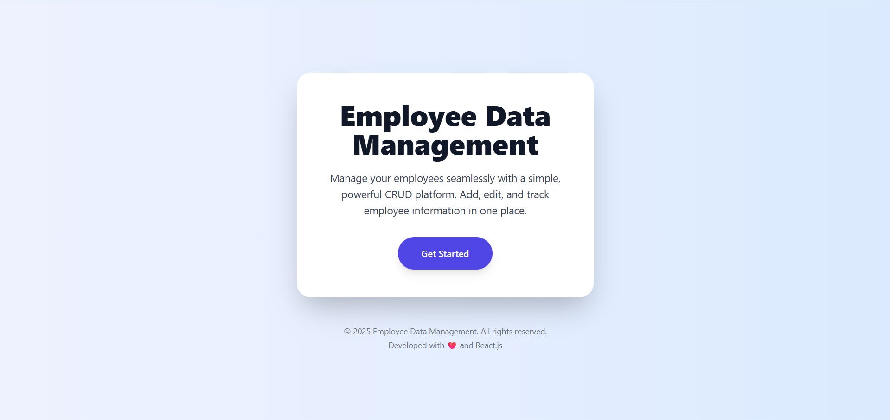
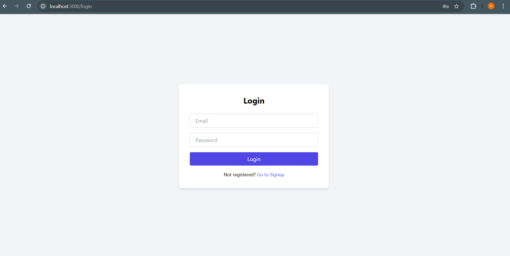
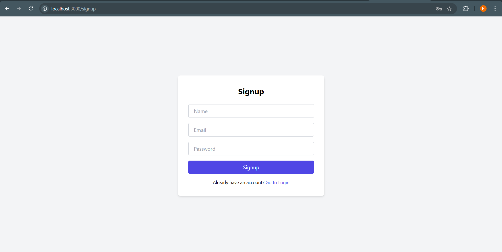
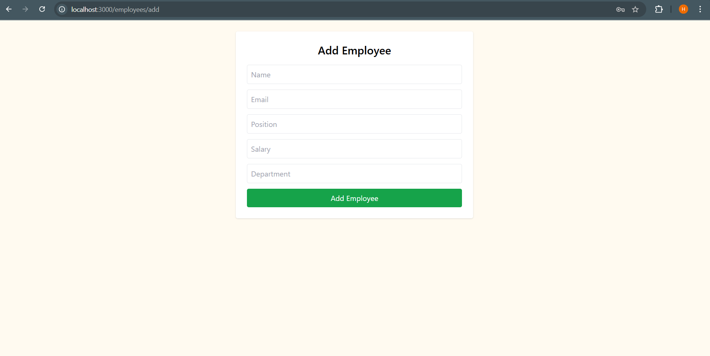
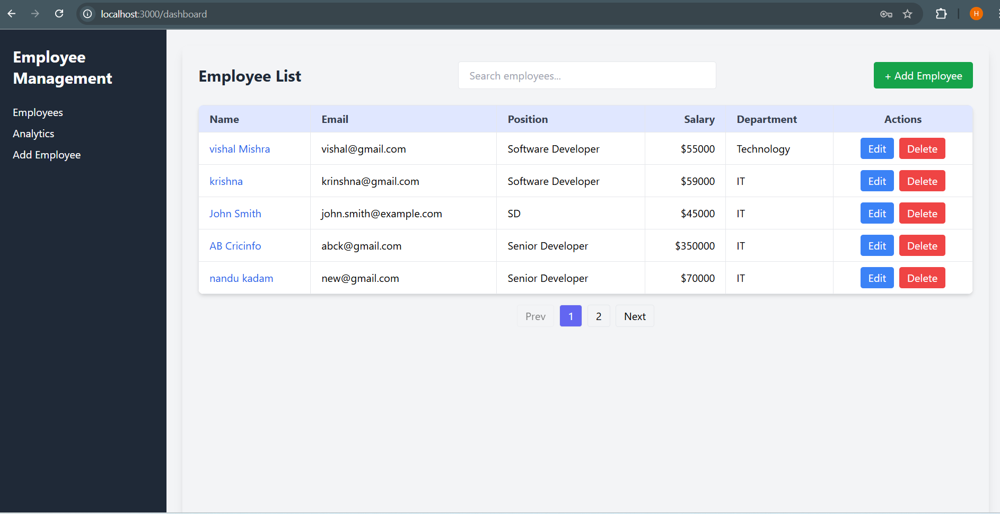
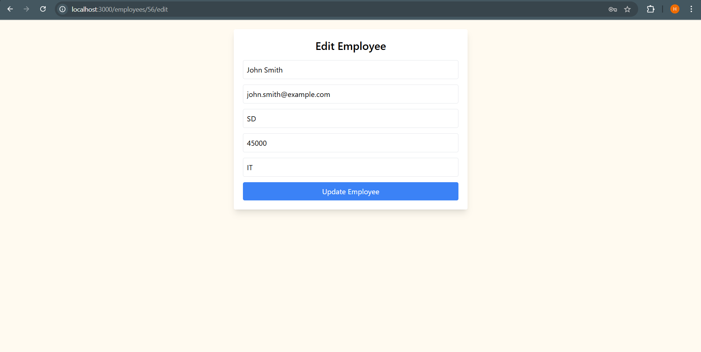
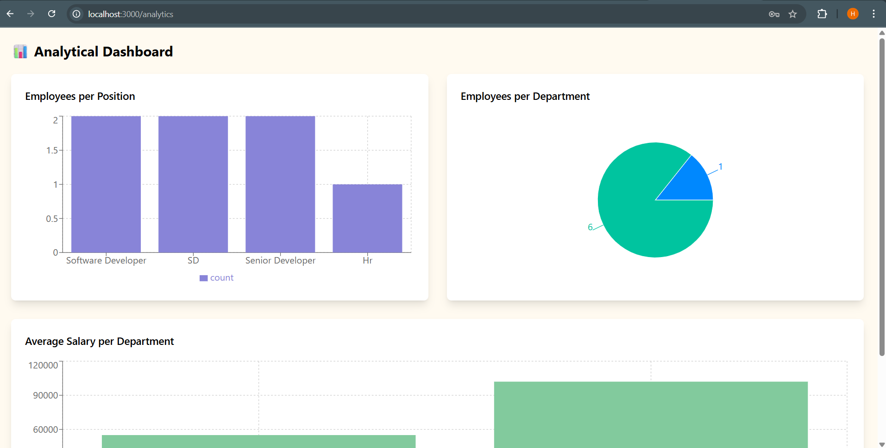

# Employee Data Management System

A full-stack CRUD (Create, Read, Update, Delete) application for managing employee records.
Built with Spring Boot (Java) for the backend and React.js for the frontend.

🚀 Project Goal

# A straightforward CRUD application to manage a list of employees. Each employee has:

Name

Email

Position

Users can create, read, update, and delete employee records via a clean and responsive UI.

🛠️ Features
🔹 Backend

# RESTful API endpoints (/api/employees) for CRUD operations

User authentication (Register/Login)

Spring Boot + Spring Data JPA + MySQL

H2 database for testing

Unit & Integration tests with JUnit & Mockito

🔹 Frontend

# React.js with functional components & hooks

Axios for API calls

Tailwind CSS for responsive UI

Form validations for Login, Signup, Add Employee, and Update Employee forms (checks required fields, valid email format, password length, etc.)

Search/filter employees by name

#Edit and delete employees via modal or inline form

🏗️ Tech Stack
# Backend

Java 21

Spring Boot 3.5.6

Spring Data JPA

MySQL (application database)

H2 (test database)

JUnit & Mockito (testing)

# Frontend

React.js

Axios

React Router DOM

TailwindCSS

# 📸 Screenshots

🏠 Home Page

🔑 Login Page

📝 Sign Up Page

➕ Add Employee

👥 Employee List

✏️ Edit Employee

📊 Analytics Dashboard

# 🗂️ Project Structure
.idea
.vscode
Employee-FrontEnd/
├─ node_modules/
├─ public/
├─ src/
│  ├─ components/
│  │  ├─ AddEmployee.js
│  │  ├─ AnalyticsDashboard.js
│  │  ├─ Dashboard.js
│  │  ├─ EditEmployee.js
│  │  ├─ EmployeeList.js
│  │  ├─ EmployeeProfile.js
│  │  ├─ Home.js
│  │  ├─ Login.js
│  │  └─ SignUp.js
│  ├─ App.js
│  ├─ App.css
│  ├─ index.js
│  └─ index.css
├─ package.json
├─ package-lock.json
├─ tailwind.config.js
└─ README.md
employeeBackend/
├─ .idea
├─ .mvn
├─ src/
│  ├─ main/
│  │  ├─ java/
│  │  │  └─ e/e/e/employeeBackend/
│  │  │     ├─ Controller/
│  │  │     ├─ Dto/
│  │  │     ├─ entity/
│  │  │     ├─ repository/
│  │  │     ├─ service/
│  │  │     └─ EmployeeBackendApplication.java
│  └─ resources/
├─ target/
├─ uploads/
├─ .gitignore
├─ .gitattributes
├─ HELP.md
├─ mvnw
├─ mvnw.cmd
└─ pom.xml
Screenshots
README.md

# Update application.properties with your MySQL credentials:
spring.datasource.url=jdbc:mysql://localhost:3306/employee_db
spring.datasource.username=root
spring.datasource.password=root
spring.jpa.hibernate.ddl-auto=update

# Run the backend:
mvn spring-boot:run

# API will be available at:
👉 http://localhost:8080/api/employees

🔹 Frontend (React)
# Navigate to the frontend folder:
cd employee-FrontEnd

# Install dependencies:
npm install

# Run the React app:
npm start

# Frontend will be available at:
👉 http://localhost:3000

# ✅ Testing

# Run backend tests:
mvn test

Tests cover:

# Employee CRUD operations

Authentication (Register/Login)

Validation & Error handling
